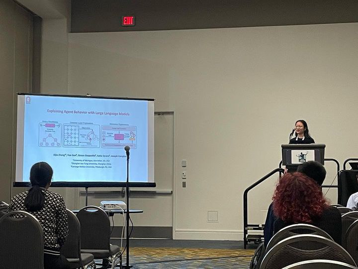
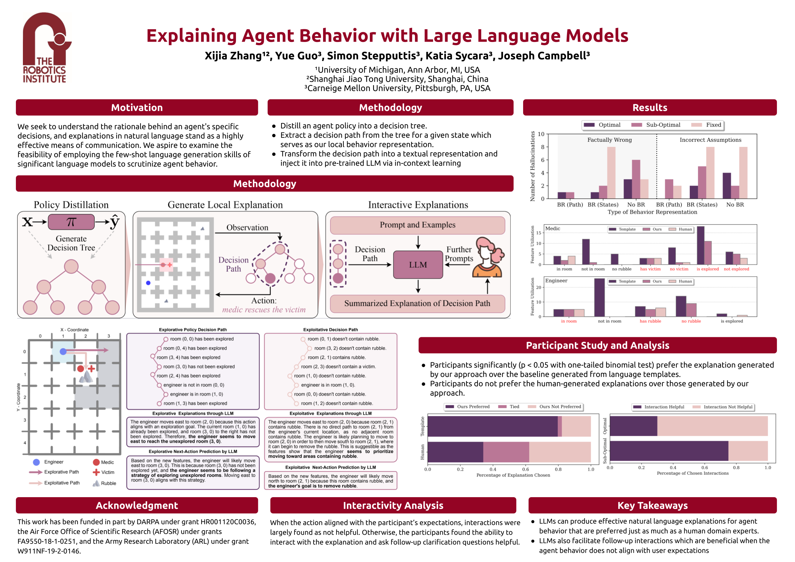

I am excited to announce that my paper has been accepted for presentation at the Human Multi-Robot Interaction Workshop, part of the International Conference on Intelligent Robots and Systems (IROS) 2023, in Detroit. This acceptance marks a significant milestone in my research career and contributes to the growing body of knowledge in the field of robotics.

Intelligent agents such as robots are increasingly deployed in real-world, safety-critical settings. It is vital that these agents are able to explain the reasoning behind their decisions to human counterparts, however, their behavior is often produced by uninterpretable models such as deep neural networks. We propose an approach to generate natural language explanations for an agent's behavior based only on observations of states and actions, agnostic to the underlying model representation. We show how a compact representation of the agent's behavior can be learned and used to produce plausible explanations with minimal hallucination while affording user interaction with a pre-trained large language model. Through user studies and empirical experiments, we show that our approach generates explanations as helpful as those generated by a human domain expert while enabling beneficial interactions such as clarification and counterfactual queries.

