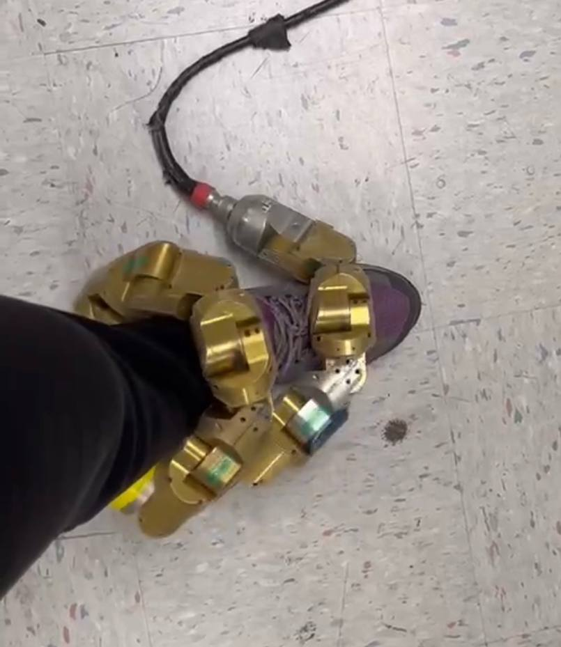
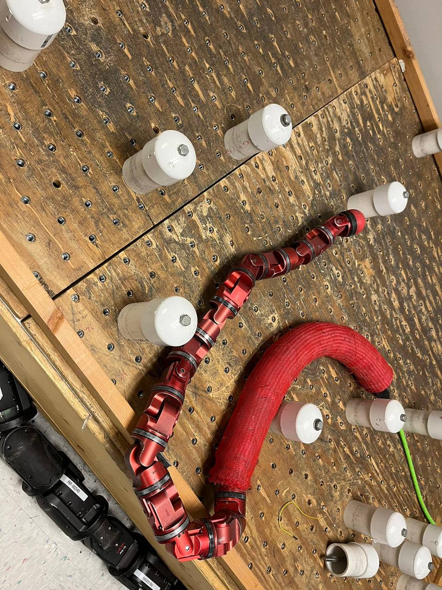
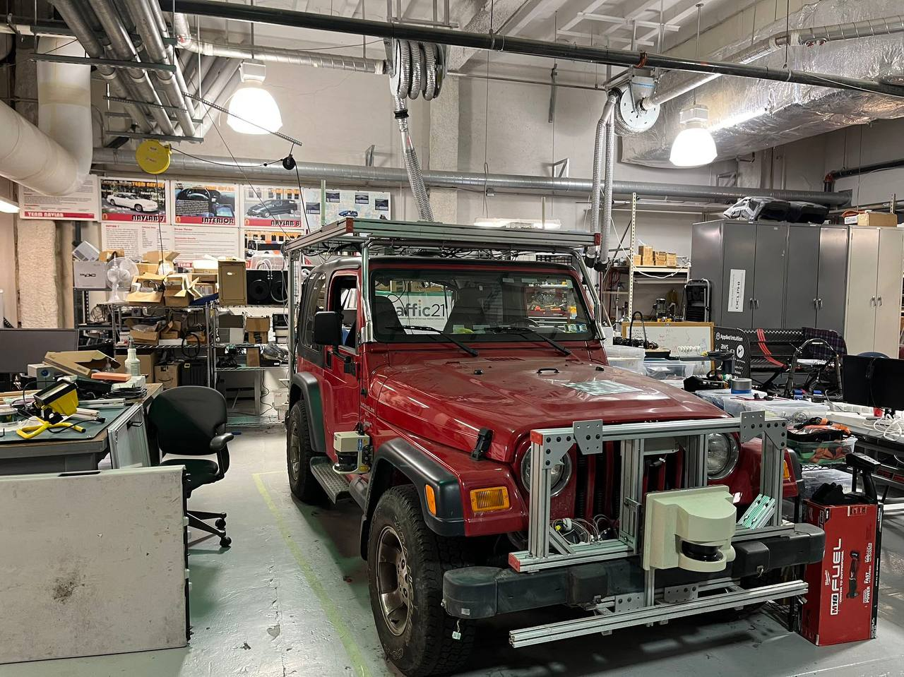
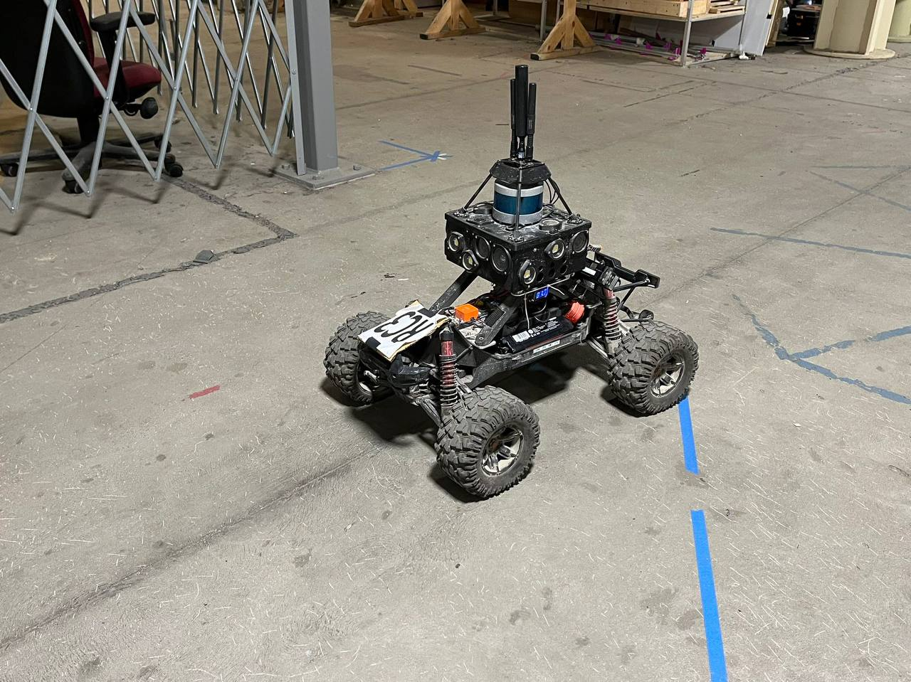
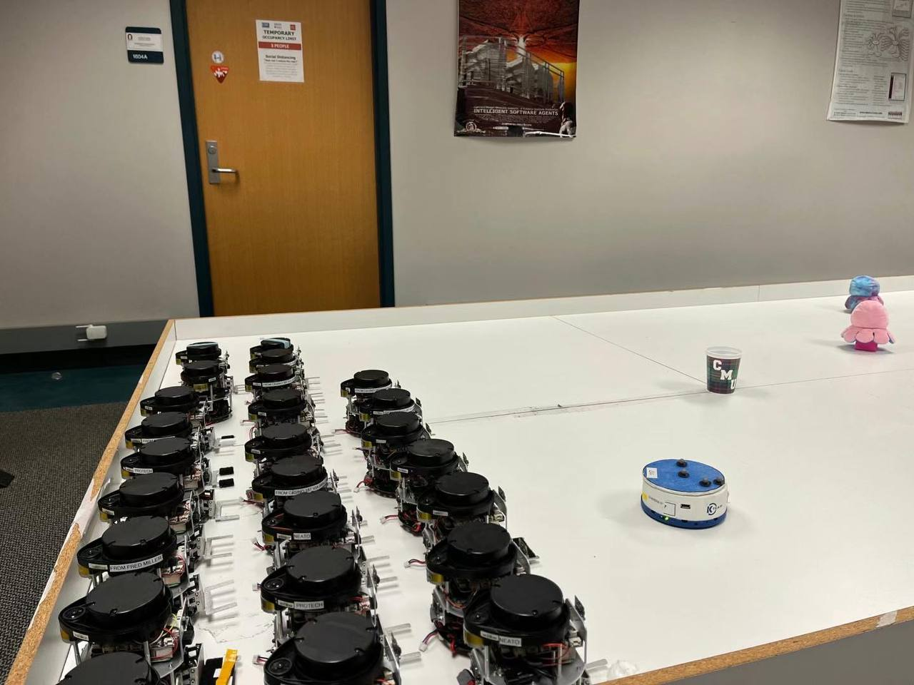
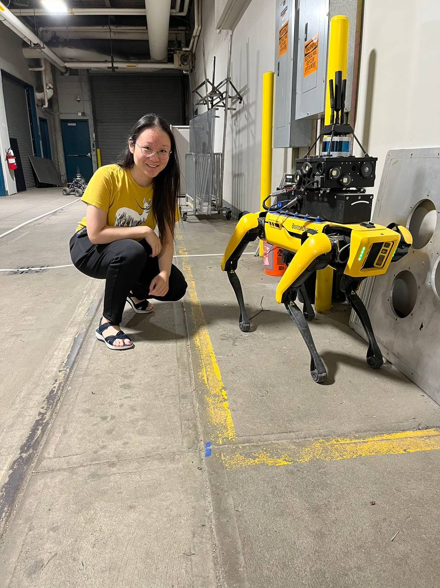

During my time as a Robotics Institute Summer Scholar, I had the chance to interact with some of the coolest robots out there. Credit to the Boston Dynamics dog at Dr. Deepak Pathak's lab, the Khephara IV robots at Dr. Katia Sycara's lab, the autonomous driving car at Dr. John Dolan's lab, and the snake robots at Dr. Howie Choset's lab. In addition to these, I witnessed a variety of drones, robotic arms, and surgical robots, among others at other labs and the Field Robotics Center.

This snake (left) literally crawled onto my leg. I was given the most unexpected leg massage of my life.

    <table>
	    <tr>
    	    <td style="padding:10px">
        	    
      	    </td>
            <td style="padding:10px">
            	
            </td>
        </tr>
    </table>

This vehicle (left) won the second prize at the DARPA Grand Challenge. I learnt the story of how people from Stanford like to exhibit a picture of their car surpassing this one near the endpoint of the race.

    <table>
	    <tr>
    	    <td style="padding:10px">
        	    
      	    </td>
            <td style="padding:10px">
            	
            </td>
        </tr>
    </table>

We had so many Khephara IVs in our lab. I mainly worked with no. 117 and no. 119 and I miss them. The two octopuses in the photo were brought by me -- who can resist adding cute obstacles in robot experiments? I look forward to their reappearance in my future publications!

I am immensely thankful to my mentors, peers, and the entire RISS community for their support and encouragement. As I move forward, I carry with me not only the knowledge and skills I have acquired but also the memories and friendships that will last a lifetime.

